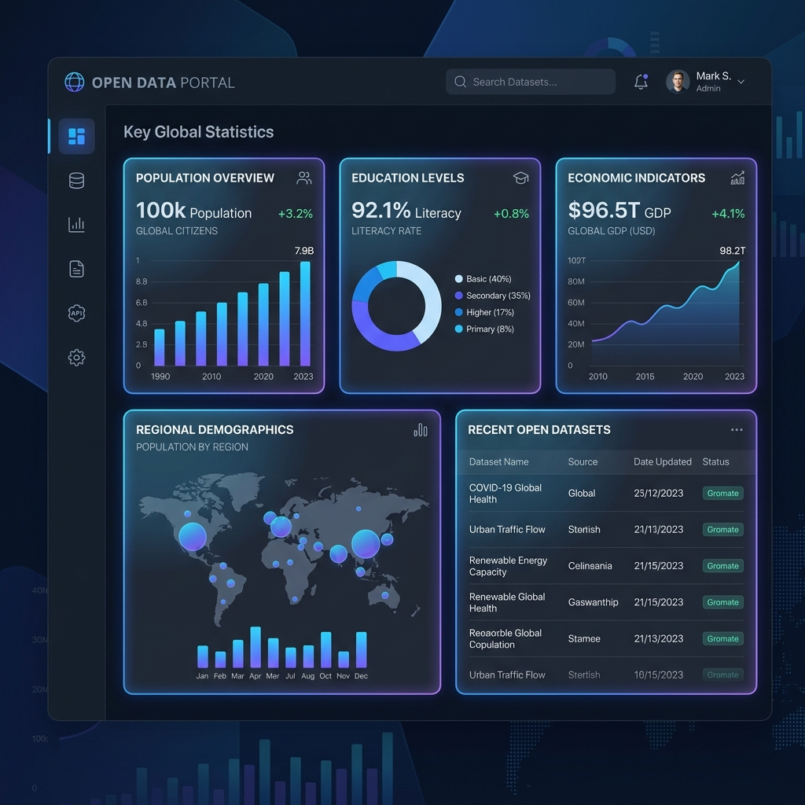

<div align="center">
  
  <h1>✨ Open Data Jatim Explorer ✨</h1>
  <p><strong>Aplikasi web modern untuk mengeksplorasi data statistik Pemerintah Provinsi Jawa Timur</strong></p>
  
  <p>
    <a href="#fitur-utama"></a>
    <a href="#teknologi"></a>
    <a href="#teknologi"></a>
    <a href="https://github.com/Fairus-24/open-data-jatim-app"></a>
  </p>
</div>

<br>

Aplikasi PHP ini dirancang untuk menyajikan data informasi publik dan statistik dari API portal **Open Data Provinsi Jawa Timur** dengan antarmuka yang memukau. Aplikasi ini dibangun dengan desain antarmuka *Glassmorphism* dan tema *Dark Mode* untuk pengalaman pengguna yang maksimal.

## 📸 Pratinjau Aplikasi


*Tampilan dashboard yang elegan dengan efek kaca transparan dan tipografi modern.*

<hr>

## 🚀 Fitur Utama

- 🔗 **Integrasi API cURL**: Menarik data langsung secara dinamis dengan request HTTP API resmi yang diformat dengan baik.
- 🛡️ **Smart Fallback System**: Ketahanan tinggi! Jika API resmi pemerintah mengalami gangguan (403/404), aplikasi secara otomatis memuat data cadangan (`mock_data.json`) tanpa menampilkan pesan error yang merusak UI.
- 🎨 **UI/UX Premium**: Desain eksklusif menggunakan efek *Glassmorphism*, palet *Dark Mode*, *hover animations*, dan *layout* yang sangat responsif di perangkat mobile maupun desktop.
- ⚡ **Ringan & Cepat**: Dibangun sepenuhnya dengan PHP *Native* dan Vanilla CSS tanpa bergantung pada framework berat.

<hr>

## 💻 Cara Menjalankan Secara Lokal

Anda dapat dengan mudah menjalankan aplikasi ini di komputer Anda menggunakan server bawaan (Built-in Web Server) dari PHP.

1. **Buka Terminal / Command Prompt**
2. **Kloning atau Arahkan ke Direktori Proyek**
   ```bash
   cd "Open Data Jatim"
   ```
3. **Mulai Server Lokal**
   Jalankan perintah ini untuk menghidupkan server PHP:
   ```bash
   php -S localhost:8000
   ```
4. **Buka Aplikasi**
   Buka browser favorit Anda dan akses:
   👉 **`http://localhost:8000`**

<hr>

## 📁 Struktur Direktori

| File / Folder | Deskripsi |
| --- | --- |
| 📄 `index.php` | File utama berisi logika PHP (cURL & manipulasi data) serta kerangka HTML. |
| 🎨 `style.css` | Kumpulan kode *Vanilla CSS* yang memberikan tampilan menakjubkan (animasi, *glassmorphism*). |
| 📊 `mock_data.json`| Data cadangan simulasi statistik Provinsi Jawa Timur. |
| 🖼️ `assets/` | Menyimpan gambar/aset aplikasi seperti *screenshot*. |

<br>

<div align="center">
  <p>Dibuat dengan ❤️ untuk eksplorasi Open Data Jatim</p>
  <p>&copy; 2026 Fairus-24</p>
</div>
